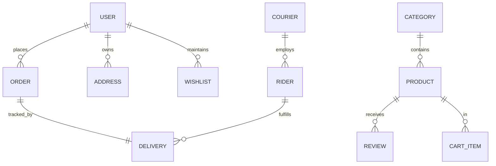

# CLOTHR — E-commerce System Documentation

Welcome to the official documentation for **Clothr**, a robust Laravel 8-based e-commerce platform specializing in modern women's fashion. This project features a multi-portal architecture designed for seamless coordination between Customers, Admins, Couriers, and Riders.

---

## 1. Project Overview
Clothr is built with a focus on role-based access control (RBAC), real-time order tracking, and atomic inventory management. The system is divided into four distinct portals:
- **Customer Portal**: Front-end shopping experience, profile management, and order tracking.
- **Admin Portal**: Centralized management of products, categories, orders, reports, and courier coordination.
- **Courier Portal**: Specialized interface for logistics companies to manage riders and dispatch orders.
- **Rider Portal**: Mobile-friendly interface for individual delivery personnel to handle last-mile delivery.

---

## 2. Folder Structure
The project follows the standard Laravel directory structure with specific organization for its multi-portal architecture.

```text
clothr/
├── app/
│   ├── Events/             # Real-time broadcasting events
│   ├── Http/
│   │   ├── Controllers/    # Public & Rider/Courier Auth
│   │   │   ├── Admin/      # Admin dashboard & management logic
│   │   │   ├── Shop/       # Cart, Reviews, Wishlist, Checkout
│   │   │   └── Profile/    # User settings & order history
│   │   ├── Middleware/     # Role-based security filters
│   ├── Models/             # Database schemas & relationships
│   └── Services/           # Core business logic (Orders, Products, Reports)
├── database/
│   ├── migrations/         # Database schema definitions
│   └── seeders/            # Initial data for testing
├── resources/
│   ├── views/              # Blade templates (Blade + Vanilla CSS)
│   │   ├── admin/          # Admin Portal UI
│   │   ├── courier/        # Courier Portal UI
│   │   ├── rider/          # Rider Portal UI
│   │   └── shop/           # Customer Portal UI
├── routes/
│   ├── web.php             # Public, Shop, and Profile routes
│   └── admin.php           # Admin-exclusive management routes
└── public/                 # Static assets (CSS, Images, JS)
```

---

## 3. System Routes
The application utilizes route grouping and middleware to isolate portal logic.

### Public & Customer Routes (`web.php`)
| Route | Method | Description |
| :--- | :--- | :--- |
| `/` | GET | Home page with featured collections. |
| `/shop` | GET | Main product catalog with filtering and sorting. |
| `/product/{id}` | GET | Detailed view of a specific product. |
| `/cart` | GET | User's shopping cart management. |
| `/checkout` | GET/POST | Secure multi-step checkout process. |
| `/profile` | GET | Customer dashboard and order history (Protected). |

### Admin Routes (`admin.php`)
| Route | Method | Description |
| :--- | :--- | :--- |
| `/admin` | GET | High-level sales and activity dashboard. |
| `/admin/orders` | GET | Global order list and status management. |
| `/admin/products` | GET/POST | Inventory and variant management. |
| `/admin/couriers` | GET/POST | Courier company registration and management. |
| `/admin/reports` | GET | Exportable sales and inventory analytics. |

### Logistics Portals
- **Courier**: `/courier/dashboard` — Manage rider assignments.
- **Rider**: `/rider/dashboard` — Real-time delivery updates.

---

## 4. Models & Database Schema
The system uses a relational database with strict constraints to ensure data integrity.

### Key Models
- **User**: Handles authentication and stores profile information. Roles include `customer`, `courier`, `rider`.
- **Product**: Stores details, pricing, and stock. Uses a `variants` JSON column for size/color inventory.
- **Order**: Captures the state of a purchase. Stores `items` and `customer_info` as immutable JSON snapshots.
- **Delivery**: Bridges Orders and Riders, tracking timestamps for each leg of the delivery journey.

### Database Relationship Diagram


---

## 5. Services & Business Logic
To keep controllers "thin," Clothr utilizes Services for complex operations.

### OrderService (`app/Services/OrderService.php`)
The heart of the system. It handles:
- **Atomic Stock Management**: Uses `DB::transaction` and `lockForUpdate` to prevent overselling during high-traffic checkouts.
- **Server-Side Verification**: Re-calculates totals from the database during checkout to prevent client-side price tampering.
- **Role-Based Transitions**: Enforces a strict state machine for order statuses (e.g., Only a Rider can mark an order as "Delivered").

### ProductService (`app/Services/ProductService.php`)
Manages the complex logic of product variants, ensuring that adding/removing colors and sizes correctly updates the overall inventory count.

---

## 6. Security Features
Clothr implements multiple layers of security to protect users and data. For developers new to web security, here are the core concepts used:

1. **Role-Based Middleware**:
   - `AdminMiddleware`: Restricts `/admin` routes to users with `is_admin = true`.
   - `RoleMiddleware`: Dynamically checks user roles (`courier`, `rider`) for logistics portals.

2. **CSRF Protection**: 
   - **What it is**: Cross-Site Request Forgery (CSRF) is an attack where another website tries to send a request to Clothr on your behalf.
   - **How we solve it**: All POST requests are guarded by Laravel's built-in CSRF tokens. The `@csrf` directive in Blade templates generates a "secret handshake" token that the server verifies to ensure the request is legitimate.

3. **Session Management (Cookies)**:
   - **What it is**: Cookies are small "ID Badges" stored in your browser.
   - **Usage**: Clothr uses these to remember that you are logged in as you move from page to page. Without these, the server would "forget" who you are every time you clicked a link.

4. **Data Snapshots**: 
   - When an order is placed, product prices and details are saved into the `orders` table as a JSON snapshot. This ensures that changing a product's price later does not affect historical order data.

5. **Ownership Verification**: 
   - Before viewing an order or address, the system verifies that the resource belongs to the currently authenticated user to prevent "Insecure Direct Object Reference" (IDOR) attacks.

---

## 7. Installation Guide

### Requirements
- PHP 7.3 or 8.0
- Composer
- Node.js & NPM
- MySQL or PostgreSQL

### Setup Steps
1. **Clone the repository**:
   ```bash
   git clone <repository-url>
   cd clothr
   ```
2. **Install Dependencies**:
   ```bash
   composer install
   npm install && npm run dev
   ```
3. **Environment Configuration**:
   - Copy `.env.example` to `.env`.
   - Set your database credentials (`DB_DATABASE`, `DB_USERNAME`, `DB_PASSWORD`).
   - Generate app key: `php artisan key:generate`.
4. **Database Setup**:
   ```bash
   php artisan migrate --seed
   ```
5. **Storage Link**:
   ```bash
   php artisan storage:link
   ```
6. **Start the Server**:
   ```bash
   php artisan serve
   ```

---

## 8. Common Developer Questions

**Q: How do I add a new order status?**
A: Update the `$validTransitions` array in `OrderService.php` and add the corresponding logic in the `updateStatus` switch statement.

**Q: Where is the design system defined?**
A: Clothr uses Vanilla CSS for maximum performance. Most styling is defined in `index.css` or within `<style>` blocks in the `layouts/shop.blade.php` and `layouts/admin.blade.php` files using CSS Design Tokens.

**Q: How does real-time notification work?**
A: The system uses `beyondcode/laravel-websockets` (Pusher replacement). Events like `NewOrderPlaced` are broadcasted to the `admin` private channel and received by the dashboard via Laravel Echo.

---

*Documentation maintained by the Clothr Dev Team. Last updated: April 2026.*
